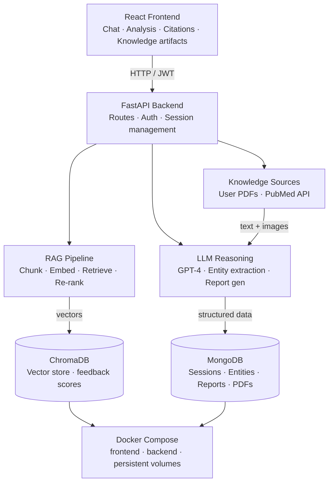

# AiMD — AI Medical Assistant

AiMD is a full-stack web application designed to make medical information more accessible through the power of artificial intelligence. It provides users with a conversational medical assistant capable of answering health-related questions, explaining symptoms, and offering general medical guidance in a clear and empathetic way.

Beyond simple conversation, AiMD offers a dedicated Analysis mode where users can upload medical documents — such as lab results, imaging reports, or clinical notes — and receive a thorough AI-driven evaluation. The assistant cross-references the uploaded content with real medical research from PubMed, synthesizes the findings, and delivers a structured report with suggestions and recommendations, all available as a downloadable PDF.

> **Disclaimer:** AiMD is not a medical device and does not provide real medical diagnoses.
> All responses, analyses, and reports are AI-generated suggestions intended for
> informational purposes only and should not be used as a substitute for professional
> medical advice, diagnosis, or treatment. Always consult a qualified healthcare provider
> with any questions you may have regarding a medical condition.

---

## Features

- **AI Chat** — Conversational medical assistant powered by GPT, grounded with RAG retrieval from previously uploaded documents
- **Medical Analysis** — Upload PDFs or images for multi-model AI analysis cross-referenced with live PubMed research
- **Knowledge Artifacts** — Automatically extracts and displays structured medical entities (conditions, symptoms, medications, lab values, recommendations) from every analysis
- **RAG Pipeline** — Dense vector embeddings via OpenAI, stored in ChromaDB, with cosine similarity retrieval and context injection into GPT prompts
- **Explainable Responses** — Every AI response shows which sources (uploaded documents or PubMed articles) were used, with relevance scores
- **Feedback Learning** — Thumbs up/down on responses adjusts chunk relevance scores in ChromaDB over time
- **PDF Report Generation** — Downloadable structured medical reports generated from analysis results
- **Session Management** — Multiple chat sessions per user, with full history and knowledge artifacts persisted in MongoDB
- **JWT Authentication** — Secure login/register with access + refresh token flow

---

## Architecture



### How GenAI is used

AiMD uses GenAI as a reasoning and retrieval engine, not just a text generator:

- **Indexing** — Uploaded documents are chunked and embedded using `text-embedding-3-small`, creating a dense vector index per session in ChromaDB.
- **Semantic search** — On every query, the user's message is embedded and the top-5 most semantically relevant chunks are retrieved via cosine similarity.
- **Synthesis** — Retrieved chunks plus live PubMed abstracts are injected into the GPT prompt as grounded context, preventing hallucination and linking responses to real sources.
- **Entity extraction** — After analysis, GPT extracts structured medical entities (conditions, symptoms, medications, lab values) as JSON, stored in MongoDB and displayed as knowledge artifacts.
- **Feedback loop** — User thumbs up/down signals are stored as metadata on ChromaDB chunks, adjusting their relevance scores for future retrievals.

---

## Tech Stack

### Frontend
- React + Vite
- Tailwind CSS
- React Router
- `motion/react` for animations
- `ogl` for WebGL Aurora/Plasma background effects

### Backend
- FastAPI (Python)
- MongoDB + Motor (async driver)
- JWT authentication via `python-jose`
- OpenAI API (`gpt-4`, `text-embedding-3-small`)
- PubMed API for live research retrieval
- ChromaDB for vector storage and semantic search

### Infrastructure
- Docker + Docker Compose
- Persistent volume for ChromaDB

---

## Getting Started

### Prerequisites

- Docker & Docker Compose
- OpenAI API key
- MongoDB connection string (Atlas or local)

### Environment Variables

Create a `.env` file in the `backend/` directory:

```env
MONGO_DB_URL=mongodb+srv://...
DB_NAME=aimd
JWT_SECRET=your_jwt_secret_here
OPENAI_API_KEY=your_openai_key_here
CHROMA_PATH=./chroma_db
```

### Run with Docker

```bash
docker compose up --build
```

The app will be available at:
- Frontend: http://localhost:5173
- Backend API: http://localhost:8000
- API Docs: http://localhost:8000/docs

---

## API Overview

| Method | Endpoint | Description |
|--------|----------|-------------|
| POST | `/api/auth/register` | Register a new user |
| POST | `/api/auth/login` | Login and receive tokens |
| POST | `/api/auth/logout` | Logout and clear cookies |
| POST | `/api/auth/refresh` | Refresh access token |
| GET | `/api/sessions` | Get all user sessions |
| POST | `/api/session` | Create a new session |
| GET | `/api/session` | Get session by ID |
| PATCH | `/api/session` | Update session title |
| DELETE | `/api/session` | Delete a session |
| POST | `/api/session/message` | Add a message to a session |
| POST | `/api/chat` | Send a chat message (RAG-augmented) |
| POST | `/api/analysis` | Upload files for medical analysis |
| POST | `/api/feedback` | Submit relevance feedback on a response |
| GET | `/api/download-report/{session_id}` | Download analysis PDF report |

---

## Usage

1. **Register or log in** at the auth screen
2. **Chat mode** — ask any medical question; responses are grounded using RAG retrieval from documents you've previously uploaded in this session
3. **Analysis mode** — upload a medical PDF or image; the AI analyzes it, retrieves relevant PubMed research, generates a structured PDF report, and extracts knowledge artifacts
4. **Citations** — expand the sources panel under any response to see which documents and PubMed articles informed the answer, with relevance scores
5. **Knowledge artifacts** — after analysis, view extracted medical entities (conditions, symptoms, medications, lab values) as structured cards
6. **Feedback** — use the thumbs up/down on responses to improve future retrieval relevance
7. **Sidebar** — switch between sessions, create new ones, or delete old ones

---

## Design Decisions

- **ChromaDB over FAISS** — persistent, queryable, supports metadata for feedback scores without external infrastructure
- **Per-session collections** — each user session gets its own ChromaDB collection, keeping knowledge isolated and deletable
- **Non-fatal RAG** — all RAG operations are wrapped in try/except so a ChromaDB failure never breaks the core chat experience
- **Stream-first responses** — citations and entity artifacts are appended to the response stream as structured tokens (`__CITATIONS__`, `__ENTITIES__`) and parsed on the frontend, keeping the API surface minimal
