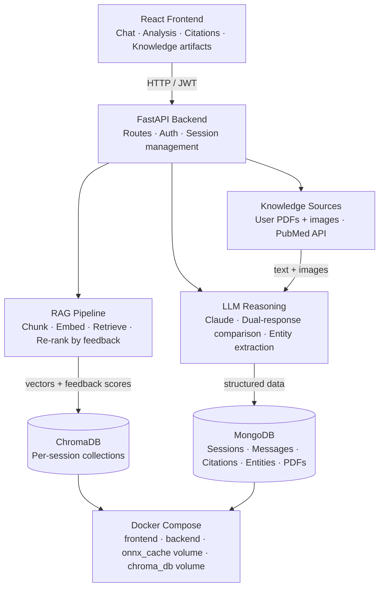

# AiMD — AI Medical Assistant

AiMD is a full-stack web application designed to make medical information more accessible through the power of artificial intelligence. It provides users with a conversational medical assistant capable of answering health-related questions, explaining symptoms, and offering general medical guidance in a clear and empathetic way.

Beyond simple conversation, AiMD offers a dedicated Analysis mode where users can upload multiple medical documents — such as lab results, imaging reports, or clinical notes — and receive a thorough AI-driven evaluation. The assistant cross-references the uploaded content with real medical research from PubMed, synthesizes the findings, and delivers a structured report with suggestions and recommendations, all available as a downloadable PDF.

> **Disclaimer:** AiMD is not a medical device and does not provide real medical diagnoses.
> All responses, analyses, and reports are AI-generated suggestions intended for
> informational purposes only and should not be used as a substitute for professional
> medical advice, diagnosis, or treatment. Always consult a qualified healthcare provider
> with any questions you may have regarding a medical condition.

---

## Features

- **AI Chat** — Conversational medical assistant powered by Claude, grounded with RAG retrieval from previously uploaded documents
- **Medical Analysis** — Upload one or more PDFs or images for multi-model AI analysis cross-referenced with live PubMed research
- **Knowledge Artifacts** — Automatically extracts and displays structured medical entities (conditions, symptoms, medications, lab values, recommendations) from every analysis, persisted in MongoDB
- **RAG Pipeline** — Dense vector embeddings via ChromaDB's built-in `all-MiniLM-L6-v2` model, with cosine similarity retrieval and context injection into Claude prompts
- **Explainable Responses** — Every AI response shows which sources (uploaded documents or PubMed articles) were used, with relevance scores, persisted across sessions
- **Functional Feedback Loop** — Thumbs up/down sends real ChromaDB chunk UUIDs to the backend, adjusting per-chunk relevance scores used in future retrievals
- **PDF Report Generation** — Downloadable structured medical reports generated from analysis results
- **Session Management** — Multiple chat sessions per user, with full history, citations, knowledge artifacts, and uploaded filenames persisted in MongoDB
- **JWT Authentication** — Secure login/register with access + refresh token flow
- **Multi-language Support** — Analysis and reports are generated in the same language as the user's input; PubMed keyword extraction always uses English MeSH terms

---

## Architecture



### How GenAI is used

AiMD uses GenAI as a reasoning and retrieval engine, not just a text generator:

- **Dual-response comparison** — Every analysis runs two parallel Claude calls at different temperatures (0.2 and 0.6), then a third call compares and merges them into a single consistent diagnosis, increasing reliability.
- **Multilingual keyword extraction** — The combined diagnosis is translated to English, then Claude extracts precise PubMed MeSH terms for literature retrieval — ensuring correct search regardless of the user's language.
- **Indexing** — Uploaded documents are chunked and embedded using ChromaDB's `all-MiniLM-L6-v2` model, creating a dense vector index per session. PubMed full-text articles are also ingested after retrieval.
- **Semantic search** — On every query, the user's message is embedded and the top-5 most semantically relevant chunks are retrieved via cosine similarity, re-ranked by accumulated user feedback scores.
- **Context injection** — Retrieved chunks plus live PubMed abstracts are injected into the Claude prompt as grounded context, preventing hallucination and linking responses to real sources.
- **Entity extraction** — After analysis, Claude extracts structured medical entities (conditions, symptoms, medications, lab values, recommendations) as JSON, stored in MongoDB and displayed as knowledge artifact cards.
- **Feedback loop** — Thumbs up/down sends the real ChromaDB chunk UUIDs to the backend, which adjusts per-chunk `feedback_score` metadata. Future retrievals combine cosine similarity with feedback scores to surface better results over time.

---

## Tech Stack

### Frontend
- React + Vite
- Tailwind CSS
- React Router
- `motion/react` for animations
- `ogl` for WebGL Aurora/Plasma background effects

### Backend
- FastAPI (Python)
- MongoDB + Motor (async driver)
- JWT authentication via `python-jose`
- Anthropic Claude API (`claude-sonnet-4-20250514`)
- PubMed Entrez API for live open-access research retrieval
- ChromaDB with `all-MiniLM-L6-v2` for vector storage and semantic search

### Infrastructure
- Docker + Docker Compose
- Persistent named volume for ChromaDB (`chroma_db`)
- Persistent named volume for ONNX embedding model cache (`onnx_cache`)

---

## Getting Started

### Prerequisites

- Docker & Docker Compose
- Anthropic API key
- MongoDB connection string (Atlas or local)
- (Optional) NCBI API key for higher PubMed rate limits

### Environment Variables

Create a `.env` file in the `backend/` directory:

```env
MONGO_DB_URL=mongodb+srv://...
DB_NAME=aimd
JWT_SECRET=your_jwt_secret_here
ANTHROPIC_API_KEY=your_anthropic_key_here
CHROMA_PATH=./chroma_db
EMAIL=your_email@example.com
NCBI_API_KEY=your_ncbi_key_here  # optional
```

### Run with Docker

```bash
docker compose up --build
```

The app will be available at:
- Frontend: http://localhost:5173
- Backend API: http://localhost:8000
- API Docs: http://localhost:8000/docs

On first run, the ONNX embedding model (~79MB) will be downloaded once and cached in the `onnx_cache` Docker volume. Subsequent restarts skip the download entirely.

---

## API Overview

| Method | Endpoint | Description |
|--------|----------|-------------|
| POST | `/api/auth/register` | Register a new user |
| POST | `/api/auth/login` | Login and receive tokens |
| POST | `/api/auth/logout` | Logout and clear cookies |
| POST | `/api/auth/refresh` | Refresh access token |
| GET | `/api/sessions` | Get all user sessions |
| POST | `/api/session` | Create a new session |
| GET | `/api/session` | Get session by ID |
| PATCH | `/api/session` | Update session title |
| DELETE | `/api/session` | Delete a session |
| POST | `/api/session/message` | Add a message to a session |
| POST | `/api/chat` | Send a chat message (RAG-augmented) |
| POST | `/api/analysis` | Upload files for medical analysis |
| POST | `/api/feedback` | Submit chunk-level relevance feedback |
| GET | `/api/download-report/{session_id}` | Download analysis PDF report |

---

## Usage

1. **Register or log in** at the auth screen
2. **Chat mode** — ask any medical question; responses are grounded using RAG retrieval from documents you've previously uploaded in this session
3. **Analysis mode** — upload one or more medical PDFs or images; the AI runs a dual-model analysis, retrieves relevant open-access PubMed research, generates a structured PDF report, and extracts knowledge artifacts. *Note: analysis typically takes 1–3 minutes due to the dual Claude inference, PubMed retrieval, PDF generation, and entity extraction running in sequence.*
4. **Citations** — expand the sources panel under any response to see which documents and PubMed articles informed the answer, with relevance percentages — citations persist across page reloads
5. **Knowledge artifacts** — after analysis, view extracted medical entities as structured color-coded cards — persisted in MongoDB and restored on session reload
6. **Feedback** — use the thumbs up/down on any response to adjust the relevance of the underlying document chunks, improving future retrievals in the same session
7. **Files drawer** — click the Files button in the header to see all uploaded documents and generated reports for the current session
8. **Sidebar** — switch between sessions, create new ones, or delete old ones

---

## Design Decisions

- **Claude over GPT** — Claude's large context window and instruction-following make it well-suited for synthesizing long medical documents and multi-source research
- **Dual-response comparison** — running two parallel inference calls and merging them reduces single-model bias and increases diagnostic consistency
- **ChromaDB per-session collections** — each session gets its own isolated collection, making deletion clean and preventing cross-contamination between users
- **Non-fatal RAG** — all RAG operations are wrapped in try/except so a ChromaDB or embedding failure never breaks the core chat experience
- **Stream-first responses** — citations and entity artifacts are appended to the response stream as structured tokens (`__CITATIONS__`, `__ENTITIES__`) and parsed on the frontend, keeping the API surface minimal and latency low
- **ONNX model caching** — the embedding model is downloaded once to a named Docker volume and warmed up at backend startup, eliminating mid-request download delays
- **Real chunk IDs in feedback** — citations carry the actual ChromaDB UUID of each chunk, so thumbs up/down directly targets the right vector metadata rather than using positional indexes